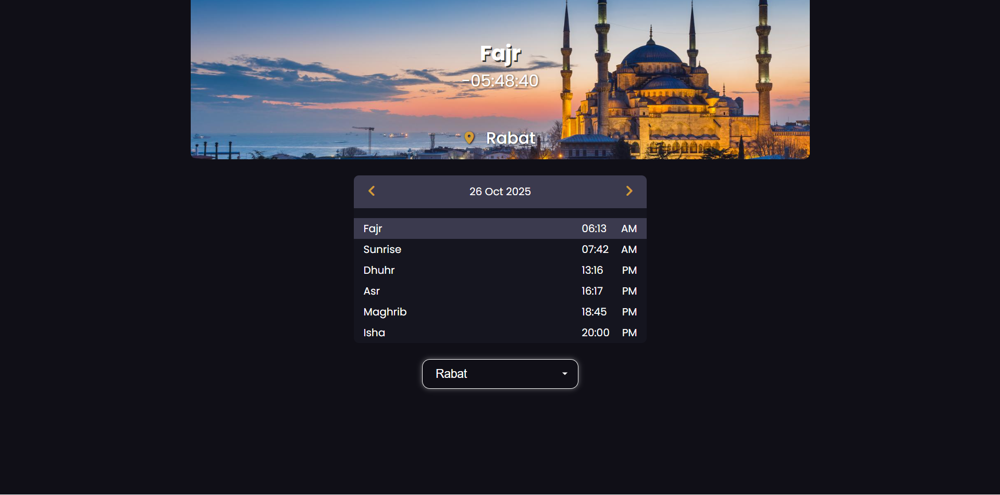

# Adhan Countdown UI

A modern web-based Islamic Prayer Times dashboard featuring automatic next-prayer detection and a live countdown timer.

## 🌙 Features

- Fetches prayer times using Aladhan API
- Highlights the upcoming prayer dynamically
- Live countdown timer to the next prayer
- Switch between cities easily
- Navigate between days of the month
- Clean and minimal user interface

## 🛠️ Technologies Used

- HTML
- CSS
- JavaScript (Fetch API)
- Aladhan Prayer Times API

## 🚀 How It Works

The app automatically detects the next upcoming prayer and starts a real-time countdown. When the user switches the city or day, the countdown updates accordingly. Users can also manually select a prayer to view remaining time.

## 🔗 API Source

[https://aladhan.com/prayer-times-api](https://aladhan.com/prayer-times-api)

## 📸 Screenshots

## 📝 License

This project is open-source and available for anyone to use and improve.
